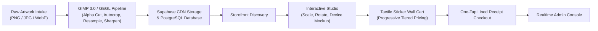
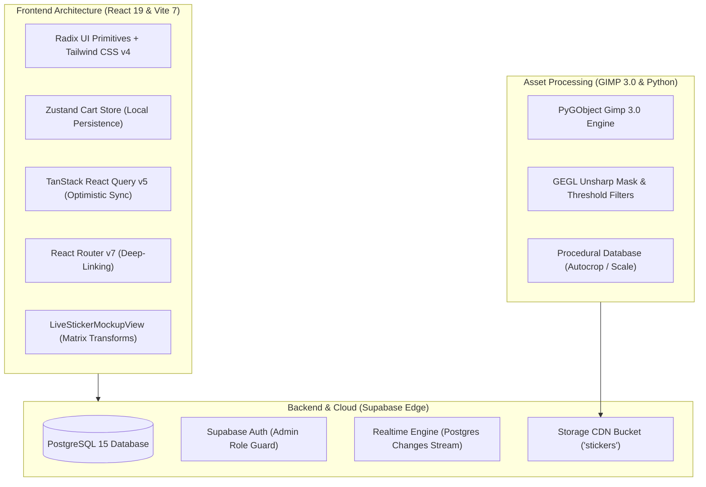
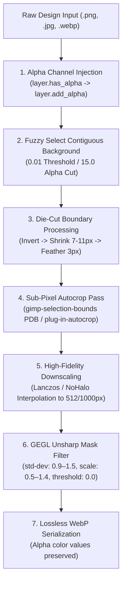

## Realz

*Engineering Stack:* React 19 • TypeScript 5.8 • Vite 7 • Tailwind CSS v4 • Supabase (PostgreSQL & Realtime) • Zustand • TanStack Query • GIMP 3.0 / GEGL Python Engine


---

## Visual Walkthrough

Below is a complete, photographic walkthrough of the primary screens that comprise the Realz platform, spanning the public storefront, the customer checkout experience, and the administrative operations suite.

**Realz** is designed to make stickers feel tangible, collectible, and expressive rather than flat images in a grid.

Built around an artwork-first philosophy, the storefront strips away the clutter of conventional retail to create an immersive, visual world. Discovery is effortless and checkout is straightforward, minimizing friction so the focus remains entirely on the art itself. And once someone finds what they love, they can easily add them to the cart in just one tap.

  

* The top navigation tracks cart item counts reactively via Zustand (`src/store/cart.ts`), updating badge numbers without page reloads.
* The category cards are fed by Supabase queries (`fetchCategories`), rendering SVG icons and counting live products dynamically.
* The "Trending Drops" section is populated directly from the `sticker_packs` table under the reserved ID `pack_trending_picks`. Clicking the floating `+` button triggers an optimistic cart insertion.

## Category Browse
 

No distracting borders, no price clutter, no star ratings, and no unnecessary card chrome. The sticker artwork *is* the interface. This gallery feel mimics flipping through physical sticker sheets. Effortless, dopamine-driven exploration that encourages customers to browse entire collections and add multiple items to their cart.

#### Interactive Studio & Device Customizer


##### What You're Seeing
The **Live Device Customizer Studio** (`/product/:id`).
* **Left Column:** High-resolution preview of the selected artwork with its category tag, full description, and hashtag keywords.
* **Middle Control Column:**
  1. *Surface Selector:* Phone, Laptop, Water Bottle, Sticker Sheet tabs.
  2. *Device Model Selector:* Brand filters (ALL (136), Apple (25), Samsung (30), Google, OnePlus) with a live search filter. Selected list displays physical dimensions (e.g., iPhone 4: `115.2 × 58.6 mm (3.5")`, iPhone 6: `138.1 × 67.0 mm (4.7")`, iPhone 15 Pro, etc.).
  3. *Surface Color Picker:* Real-world OEM colorways (Midnight, Starlight, Titanium, Deep Purple, Alpine Green) with interactive swatch pills.
* **The Canvas:** An SVG Canvas representation of the selected device with exact camera module geometry. The sticker is rendered on the device back with interactive transform handles for rotation, scale, and positioning.
* **Right Column:** Stash panel with "SWITCH" and "+ ADD" tabs, displaying other stickers for multi-sticker collage testing on a single surface.

Implemented in `src/components/mockup/LiveStickerMockupView.tsx` and `StickerTransformLayer.tsx`:
* Millimeter dimensions from `mockup-data.ts` calculate the physical scale factor relative to a baseline 147mm phone height
* As the user drags the corner handles, CSS transform matrices update in real time without triggering expensive React re-renders.

This feature eliminates one of the causes of online sticker purchase hesitation: **fear of incorrect size**. By providing an exact millimetre simulation against the user's specific phone model or other surface, the user sees exactly how the sticker clears their camera bump and how much room remains for other stickers.

## Checkout


The checkout screen (`/selections`), split into two sections:
* **Left Canvas ("Your Sticker Wall"):** A personal board style wall displaying all handpicked stickers. Hovering over any sticker exposes quantity increment/decrement buttons and a trash action.
* **Right Canvas (Receipt & Order Slip):**
  * *Jagged-edge Paper Receipt:*
    * `ORDER SUMMARY`
    * `TOTAL ITEMS`
    * `RECEIPT BREAKDOWN:`
    * `TOTAL DUE:`
    * `TIERS BADGES:`
    * `AVG UNIT PRICE:`
  * *Notebook Checkout Slip:*
    * `NAME: Full name`
    * `PHONE: 0712345678` (pre-formatted for Kenyan carriers)
    * `LOCATION: Area / Neighborhood`
    * **`CONFIRM ORDER`**

* The progressive stepwise tier calculation is executed by `src/lib/pricing.ts`:
```typescript
export function getBreakdown(totalQty: number) {
  const breakdown = [];
  if (totalQty > 0) breakdown.push({ qty: Math.min(totalQty, 20), price: 15.50 });
  if (totalQty > 20) breakdown.push({ qty: Math.min(totalQty - 20, 25), price: 13.49 });
  if (totalQty > 45) breakdown.push({ qty: totalQty - 45, price: 10.99 });
  return breakdown;
}
```
* Submitting the order executes a database transaction inserting an entry into `orders` and bulk records into `order_items`

### Realz Admin


* The dashboard aggregates real-time counts using PostgreSQL relational queries via `src/lib/admin-api.ts`.
* The `Realtime Sync` badge indicates an active Supabase WebSocket subscription listening on table changes, ensuring live counts update without manual page refreshing.


Implemented in `src/pages/admin/AdminOrders.tsx`:
* Orders are filtered using SQL status enums (`OrderStatus`).
* Changing an order's status triggers instant database updates and can trigger automated WhatsApp messaging to the customer via `toKenyanWhatsAppUrl`.
* Batch-selection checkboxes allow operators to select multiple orders simultaneously and export vector cut-lines or dispatch in bulk.


Organized by category folders. Select a folder to view and upload stickers.
* Each folder maps directly to a record in the `categories` PostgreSQL table, linked to subfolders in the Supabase `stickers` storage bucket.
* Clicking any folder navigates deeper into the **Subcategory System**, partitioning large categories.


By structuring the catalogue like a native operating system filesystem with folder hierarchies and visual image chips, catalogue managers can locate and edit any sticker in seconds.


The bulk media ingestion interface (`/admin/products/bulk`).
* **Left Dropzone:** Massive drag-and-drop zone
* **Right Settings Panel:**
  * *Destination Category:* Dropdown selecting target folder.
  * *Initial Storefront Status:* Toggle between `Live (Published)` and `Draft Review`.
  * *Automated Pipeline Intake Rules:*
  * * * When artwork files are dropped, client-side canvas analysis inspects pixel data to ensure the image possesses true alpha channel transparency (preventing accidental uploads of solid-white square backgrounds)
      * Filenames are parsed via regular expressions into clean title strings
      * Files are uploaded directly to the Supabase storage bucket, generating CDN URLs and auto-inserting product records in a single asynchronous batch.
* **Header Controls:** Studio view toggle, Alpha preview toggle, and `Select Files` button.


* In Realz, clicking "Delete" on any sticker never executes an immediate destructive SQL `DELETE FROM products`. Instead, it sets the status column to `archived` (`moveToBin`).
* The product is immediately removed from the customer storefront and active search queries, but its relational integrity in historical customer orders is preserved.
* The bin allows catalogue managers to review, restore, or permanently purge items when verified.


* The board synchronizes with the `sticker_packs` record where `id = 'pack_trending_picks'`.
* The `sticker_ids` array stores the exact slot order. Reordering cards via drag-and-drop mutates the array and commits an instant optimistic update back to Supabase.
* Allows administrators to swap any of the 16 homepage hero slots with a single click. Clicking a sticker immediately replaces the targeted slot and syncs the order to Supabase.


The bundle creation modal.
* **Left Configuration Panel:**
  * *Pack Title:* 
  * *URL Slug:* Auto-generated SEO slug.
  * *Badge Pill:* 
  * *Bundle Commercials (KES):*
    * `Pack Selling Price:` 
    * `Base Catalogue Value:`
    * `Discount Indicator:`
  * *Storefront Status:* Toggle between `Published` and `Draft`.
* **Right Catalogue Selection Pane:** Searchable sticker grid with category dropdown filter to select pack contents.
* **Bottom Bar:** Dynamic validation indicator: 

* When stickers are checked in the right pane, the modal recalculates base catalogue value dynamically:
```typescript
const baseValue = selectedStickers.length * BASE_TIER_PRICE;
const savings = baseValue - packSellingPrice;
```
* On save, the bundle payload is upserted into the `sticker_packs` table with embedded `sticker_ids` JSON arrays.


Realz tracks **unit economics, raw material costs, and net margin yield**. Because Realz controls the manufacturing and cutting process, tracking COGS per unit ensures the business operates at peak profitability.
* The leaderboard aggregates historical rows from `order_items` grouped by `product_id`.
* It ranks products by unit velocity, computing gross revenue and estimated net profit per SKU
* The telemetry engine calculates metrics in real time via `fetchExecutiveFinancials` in `src/lib/admin-api.ts`.

## Technical Stack & Architecture



---

## Security, Data Integrity & Scalability

* **Row Level Security (RLS):** Supabase RLS policies guarantee that customer personal identifiable information (PII)—phone numbers, names, physical drop locations—is inaccessible via public API keys. Only authenticated admin sessions can view or update order queues.
* **Storage Access Policies:** Public users are granted `SELECT` access to the `stickers` bucket to fetch WebP assets, while `INSERT`, `UPDATE`, and `DELETE` permissions are strictly restricted to authenticated administrators.
* **Lossless WebP Bandwidth Savings:** Raw PNGs averaged 850 KB to 2.4 MB per asset. After processing through the GIMP 3.0 / GEGL pipeline into optimized WebP format, average asset weight dropped to **85–120 KB**—an **88% reduction in bandwidth**—enabling instant load times across mobile 3G/4G connections.
* **Optimistic State & Client-Side Resiliency:** The Zustand cart store is serialized to browser `localStorage`. If a user refreshes their browser or loses connectivity in transit, their entire sticker wall is restored upon return.

---

## GIMP 3.0 

To eliminate manual graphic design overhead, Realz utilizes an automated batch pipeline written in Python 3 using GIMP 3.0’s GObject Introspection bindings (`gi.repository.Gimp`).



*Live Production Platform:* [realz254.vercel.app](https://realz254.vercel.app)
